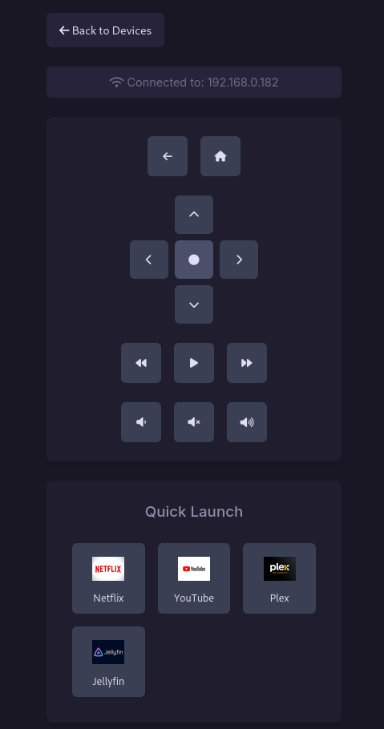

# Roku Remote Control

A sleek, modern web-based Roku remote control application that allows you to discover and control Roku devices on your local network. Built with Flask and styled with the beautiful Rosé Pine theme.



## Features

- **Device Discovery**: Automatically scan and find Roku devices on your local network
- **Loads All Apps**: Now loads all installed apps from your Roku device, not just a predefined list.
- **Full Remote Control**: Complete set of remote control functions including:
  - Navigation (Up, Down, Left, Right, OK)
  - Playback controls (Play/Pause, Forward, Rewind)
  - Volume controls (Up, Down, Mute)
  - Home and Back buttons
- **Beautiful UI**: 
  - Rosé Pine dark theme
  - Responsive design that works on both desktop and mobile
  - Touch-optimized for mobile devices
  - Smooth animations and visual feedback
- **Local Network**: Works entirely on your local network with no external dependencies

## Docker Installation

### Option 1: Using Docker Compose (Recommended)

1. Clone the repository:
   ```bash
   git clone https://github.com/denialmedia/roku_remote.git
   cd roku_remote
   ```

2. Build and start the container:
   ```bash
   docker-compose up -d
   ```

3. Access the remote at `http://your-server-ip:6969`

### Option 2: Using Docker Directly

1. Build the image:
   ```bash
   docker build -t roku-remote .
   ```

2. Run the container:
   ```bash
   docker run -d --network host --name roku-remote roku-remote
   ```

## Installation

1. Clone this repository:
```bash
git clone https://github.com/denialmedia/roku_remote.git
cd roku_remote
```

2. Create and activate a virtual environment (recommended):
```bash
python -m venv venv
source venv/bin/activate  # On Windows: venv\Scripts\activate
```

3. Install the required dependencies:
```bash
pip install -r requirements.txt
```

## Usage

1. Start the application:
```bash
python roku_remote.py
```

2. Open your web browser and navigate to:
- `http://localhost:5000` (local access)
- `http://your_computer_ip:5000` (access from other devices on your network)

3. Click "Scan for Devices" to find Roku devices on your network

4. Select a device to open its remote control interface

## Development Setup

1. Create a virtual environment:
   ```bash
   python -m venv venv
   source venv/bin/activate  # On Windows: venv\Scripts\activate
   ```

2. Install dependencies:
   ```bash
   pip install -r requirements.txt
   ```

3. Run the application:
   ```bash
   python roku_remote.py
   ```

## Network Requirements

- The app must be on the same network as your Roku devices
- Port 6969 must be accessible for the web interface
- SSDP (UDP port 1900) must be accessible for device discovery

## Notes

- The container uses host networking to enable Roku device discovery
- The web interface is accessible on port 6969
- The app will automatically discover Roku devices on your network
- App icons are fetched directly from your Roku devices

## Security

- The app is designed for local network use only
- Consider using a reverse proxy with HTTPS for external access
- No authentication is currently implemented

## Requirements

- Python 3.6 or higher
- Network access to Roku devices
- Roku devices must be on the same network as the computer running this application

## Dependencies

- `python-roku`: For Roku device communication
- `Flask`: For the web interface

## Development

The project structure is organized as follows:

```
roku_remote/
├── roku_remote.py        # Main Flask application
├── requirements.txt      # Python dependencies
├── static/
│   ├── css/
│   │   └── style.css    # Styles with Rosé Pine theme
│   └── js/
│       └── script.js    # Frontend JavaScript
└── templates/
    ├── base.html        # Base template
    ├── index.html       # Device scanner page
    └── remote.html      # Remote control interface
```

## Contributing

1. Fork the repository
2. Create your feature branch (`git checkout -b feature/AmazingFeature`)
3. Commit your changes (`git commit -m 'Add some AmazingFeature'`)
4. Push to the branch (`git push origin feature/AmazingFeature`)
5. Open a Pull Request

## License

This project is licensed under the MIT License - see the [LICENSE](LICENSE) file for details.

## Acknowledgments

- [python-roku](https://github.com/jcarbaugh/python-roku) library
- [Rosé Pine](https://rosepinetheme.com/) theme
- Font Awesome for icons
